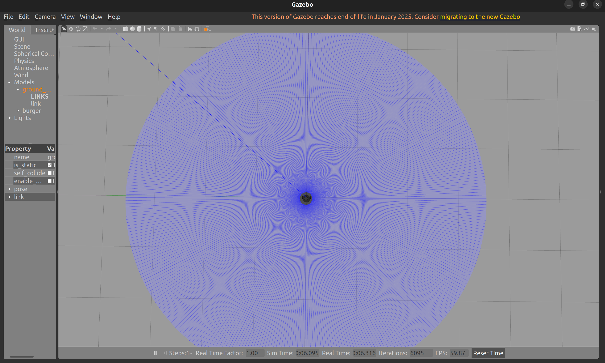
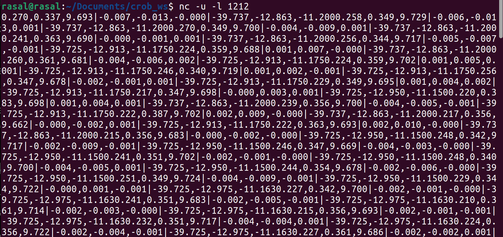

# Mobile IMU Telemetry Controller for TurtleBot3

This repository contains a ROS 2 (Humble) package designed to control a TurtleBot3 in a Gazebo simulation using real-time IMU sensor data streamed over UDP from an Android smartphone.

This project is being developed as part of the **CROB Robotics Team Phase 2 Recruitment Task** (Robotics Systems, Simulation & Control Domain).

## System Architecture (Current State)

```text
[Android Smartphone] 
       │
       │ (Raw IMU Data: Accel, Gyro, Mag)
       │ UDP Stream over Wi-Fi (Port: 1212)
       ▼
[Ubuntu 22.04 Workstation]
       │
       │ (Python Socket Listener)
       ▼
[Data Parsing & Terminal Output]
```

### Prerequisites
- OS: Ubuntu 22.04 LTS
- Middleware: ROS 2 Humble Hawksbill
- Simulator: Gazebo11 (ros-humble-gazebo-ros-pkgs)
- Robot Packages: ros-humble-turtlebot3, ros-humble-turtlebot3-gazebo
- Mobile App: [VirtualIMU APK (Android)](https://github.com/ANANDHUAJITH/mobile2rosimu/releases/tag/v1.0.0)

## Week 1 Setup & Execution

1. Network Configuration
Ensure your PC and Android phone are connected to the same Wi-Fi network.
Find your PC's local IP address:

```bash
ip addr show
```

Open port 1212 for incoming UDP traffic:

```bash
sudo ufw allow 1212/udp
```

2. Mobile App Setup
Install the VirtualIMU APK on your Android device.
Enter your PC's local IP address and set the port to 1212.
Tap Start UDP Stream.

3. Running the Base Simulation

```bash
export TURTLEBOT3_MODEL=burger
ros2 launch turtlebot3_gazebo empty_world.launch.py
```

## Progress Gallery

Figure 1: 
Figure 2: 

## Challenges Faced

- Network Firewall Restrictions: Initially, the UDP packets were being dropped. I resolved this by utilizing ufw to explicitly open port 1212 for incoming UDP traffic and verifying the stream using netcat before connecting the Python script.

- Coordinate System Mismatch: Discovered that raw accelerometer data mapping differs between standard aeronautical models and Android hardware (where the Y-axis is vertical).


## Week 2 Roadmap & Future Works

Currently, the system successfully establishes a localized network bridge and parses raw telemetry. The next phases of development include:

- ROS 2 Integration: Wrapping the data listener into a native rclpy node.
- Kinematic Mapping: Calculating Pitch and Roll from the raw ax, ay, az vectors, accounting for Android's specific hardware coordinate frames.
- Velocity Publishing: Translating the angular tilts into linear ($v_x$) and angular ($\omega_z$) velocities via geometry_msgs/Twist.
- Bonus Implementation (Future Work): Developing a Simple Moving Average (SMA) filter to smooth the incoming noisy accelerometer data before publishing velocity commands, ensuring fluid robotic movement.
